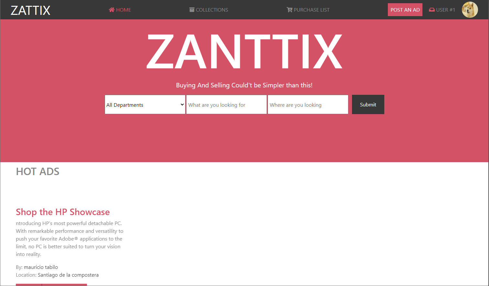

# Capstone

> Project: Capstone #1.

The first capstone project for microverse, create a page using the requested requisites: (https://www.behance.net/gallery/24796463/ZATTIX)

## Built With

- Html
- CSS
- Bootstrap
- Fontawesome

## Live Demo

[Live Demo Link](https://nexch.github.io/Capstone/)

## Getting Started

To get a local copy up and running follow these simple example steps.

### Prerequisites
Having a computer and git working.
### Setup
git clone https://github.com/Nexch/Capstone.git
### Usage
Open it in your favorite browser
## Authors
👤 **Mauricio Tabilo**

- Github: [@Nexch](https://github.com/Nexch)
- Twitter: [@@MfinchT](https://twitter.com/MfinchT)
- Linkedin: [linkedin](https://www.linkedin.com/in/Nexch)

## 🤝 Contributing

Contributions, issues and feature requests are welcome!

Feel free to check the [issues page](issues/).

## Show your support

Give a :fire: if you like this project!

## Acknowledgments

- I will like to express my sincere gratitude to Microverse, this incredible opportunity
- Microverse
- Mohammed Awad on Behance for the desing idea

## 📝 License

Design idea by [Mohammed Awad on Behance](https://www.behance.net/M_Awad)
